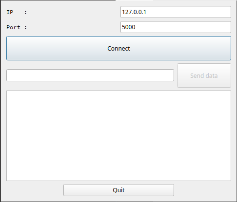
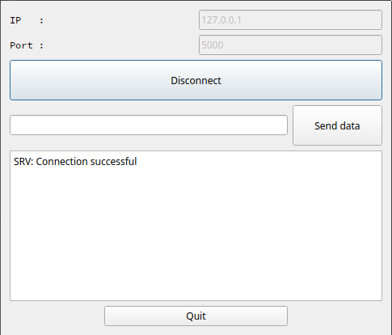
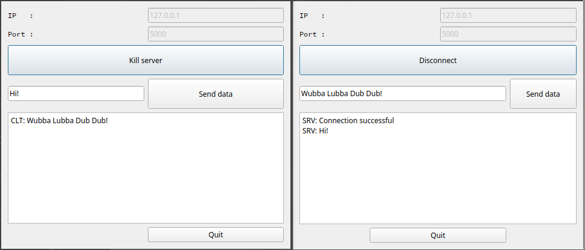

# TCP Socket: Client

**Keywords**: TCP, client, connection, server

**Testing**: QTcpSocket, QString, QByteArray

## How-to

When launching the GUI, it appears as follows:

Then, launch an instance of [**socketTcpServer**](https://github.com/KC5-BP/aMessOfATestss/tree/main/c_cpp/Qt/socketTcpServer)
and connect to it to start exchanging data between client & server.

After a connection has been established, the server sends a validation message, like seen below:

Then, with both apps running, exchange can be tested (**server on the left** and ***client on the right***):

## Note

Sending "Leaving" from either party will close the connection. This is done to ensure when the server OR client disconnects itself to properly free resources and close the connection.
