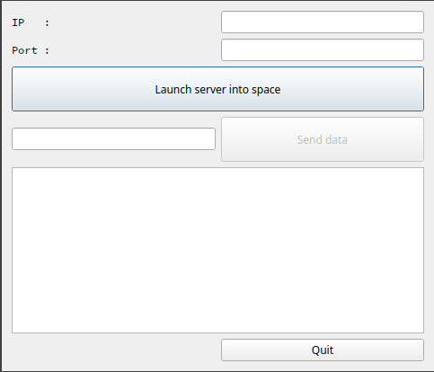
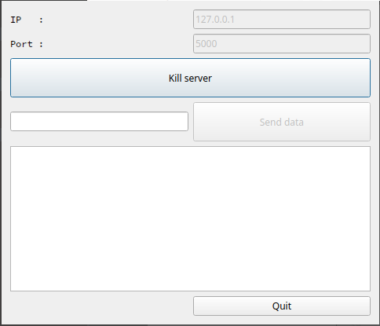

# TCP Socket: Server

**Keywords**: TCP, server

**Testing**: QTcpServer, QTcpSocket, QString, QByteArray

## How-to

When launching the GUI, it appears as follows:

Both IP and Port can be configured manually. They can also be automatically assigned if one of the two is empty.

Then, launch an instance of [**socketTcpClient**](https://github.com/KC5-BP/aMessOfATestss/tree/main/c_cpp/Qt/socketTcpClient)
and make it connect to the server to start exchanging data with it.

With both apps running and after a connection has been established, the server will send a validation message, like seen below, and exchange can be tested (**server on the left** and ***client on the right***):

## Note

Sending "Leaving" from either party will close the connection. This is done to ensure when the server OR client disconnects itself to properly free resources and close the connection.
