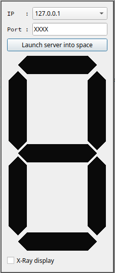
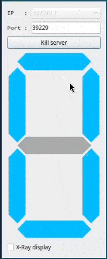
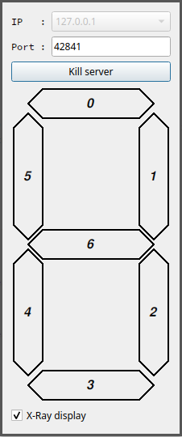

# TCP Controlled 7Segments

**Keywords**: TCP, server, 7segments, display, controlled, x-ray

**Testing**: QTcpServer, QTcpSocket, QString, QByteArray, QPainter & Co

## How-to

When launching the GUI, it appears as follows:



Compared to [**socketTcpClient**](https://github.com/KC5-BP/aMessOfATestss/tree/main/c_cpp/Qt/socketTcpClient) & [**socketTcpServer**](https://github.com/KC5-BP/aMessOfATestss/tree/main/c_cpp/Qt/socketTcpServer), the IP is automatically retrieved from possible options and added to a ComboBox. The Port is randomly generated each time the server is launched (for programming simplicity).

Then, launch an instance of [**socketTcpClient**](https://github.com/KC5-BP/aMessOfATestss/tree/main/c_cpp/socket/clientToDriveQt7SegApp) & connect to the 7segments display application with:

```shell
./qt7SegDriver <ip> <port>
```

*Note*: qt7SegDriver can be killed with Ctrl+C (SIGINT signal). It will send "Leaving" to the server for it to properly free its resource and accept a new client later on, and then properly close the connection on its side.

A counting sequence in hexa should be displayed on the GUI in blue color:



An X-Ray checkbox has been implemented to see the outline of each segment and their respective index:


